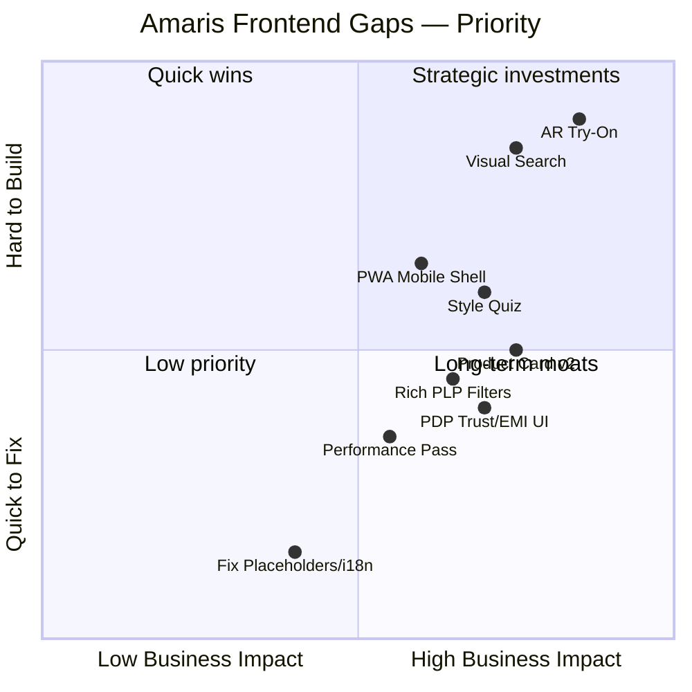

Skip to content
Using Gmail with screen readers
1 of 358
Report
Inbox

Mrigank Singh
Attachments
12:20 (6 minutes ago)
to me

PFA
 One attachment
  •  Scanned by Gmail
# Amaris Jewels — Frontend Gap Report & Fix Plan

**Benchmark:** [Tanishq](https://www.tanishq.co.in/)  
**Site under review:** [Amaris Jewels](https://www.amarisjewels.com/)  
**Stack context:** Shopify theme (custom luxury storefront)  
**Focus:** Frontend UX, UI patterns, interaction design, and client-side implementation — not backend/ERP/inventory systems.

---

## 1. Frontend Maturity Snapshot

| Layer | Tanishq (benchmark) | Amaris (current) | Frontend gap severity |
|---|---|---|---|
| **Homepage** | Occasion tiles, trending, recovery blocks, gold-rate strip | Editorial banners, celebrity carousel, collections | Medium |
| **PLP (listing)** | Rich filters, Try It, Similar, urgency badges, infinite scroll | Basic filters, Quick Buy only | **High** |
| **PDP (product)** | Try-on, size guide gate, find-in-store, reviews, EMI strip | Spec tables, static ring chart, WhatsApp CTA | **High** |
| **Search** | Text + visual/image search | Text search only | **High** |
| **Navigation** | Occasion + category + gender taxonomy | Category + campaign-led nav | Medium |
| **Personalization UI** | Quiz, recently viewed rails, pick-up-where-you-left | Recently viewed / you may also like (basic) | **High** |
| **Store UX** | Locator, book appointment, find-in-store modal | Static store list, manual coordination | Medium |
| **Trust UI** | Reviews, assurance badges, making-charge callouts | Certification copy, no visible reviews | Medium |
| **Accessibility** | Mature labels | Broken i18n strings on carousels | **Critical (quick fix)** |
| **Content QA** | Production-ready | Live placeholder blocks | **Critical (quick fix)** |
| **Mobile** | App + optimized web flows | Responsive Shopify, no PWA/app shell | Medium |

---

## 2. Critical Frontend Gaps (Fix First)

These are visible production issues that erode luxury brand perception immediately.

### Gap 2.1 — Live Placeholder / Draft Content

**Observed on Amaris**

- Homepage/PDP blocks showing: *"Welcome to Palo Alto — Add more info or delete this text"*
- Suggests unpublished Shopify section still wired into production theme

**Tanishq benchmark**

- No draft/placeholder modules in customer-facing templates

**Frontend fix steps**

1. Audit theme in Shopify Admin → **Online Store → Themes → Edit code**
2. Search theme for `"Palo Alto"` and `"Add more info"` across:
   - `sections/*.liquid`
   - `templates/*.json`
   - `config/settings_data.json`
3. Remove or replace section instances in homepage + PDP JSON templates
4. Add a pre-deploy checklist: no lorem/placeholder strings in `sections/` or `locales/`
5. Optional: CI/lint script grepping for known placeholder phrases before theme publish

**Effort:** 0.5–1 day  
**Impact:** High trust recovery

---

### Gap 2.2 — Broken Accessibility / i18n Strings

**Observed on Amaris**

- Carousel controls render as: `Translation missing: en.general.accessibility.previous/next`

**Tanishq benchmark**

- Proper ARIA labels on sliders and modals

**Frontend fix steps**

1. Open `locales/en.default.json` (and `en.default.schema.json` if used)
2. Add missing keys under `general.accessibility`:

   ```json
   {
     "general": {
       "accessibility": {
         "previous": "Previous slide",
         "next": "Next slide",
         "close": "Close",
         "skip_to_content": "Skip to content"
       }
     }
   }
   ```

3. Audit all carousel/slider snippets (`snippets/icon-chevron.liquid`, slideshow sections) — replace hardcoded labels with `{{ 'general.accessibility.previous' | t }}`
4. Run axe/Lighthouse accessibility pass on homepage, PLP, PDP
5. Fix focus traps on Quick Buy drawer and concierge modal

**Effort:** 1–2 days  
**Impact:** Accessibility compliance + polish

---

### Gap 2.3 — Persistent Browser Warning Banner

**Observed on Amaris**

- Top banner: *"This site has limited support for your browser..."* on every page load

**Tanishq benchmark**

- No intrusive compatibility strip

**Frontend fix steps**

1. Locate banner in theme header or app embed
2. Either remove entirely (modern Shopify themes support evergreen browsers) or:
   - Show only once via `localStorage` dismiss
   - Restrict to truly unsupported UA (IE11), not Safari/Chrome
3. Replace with slimmer promo strip (shipping/IGI/certification) if top space is needed

**Effort:** 0.5 day  
**Impact:** Cleaner first impression

---

## 3. PLP (Collection Page) Frontend Gaps

Tanishq's listing page is effectively a **decision engine**. Amaris's is a **product grid**.

### Gap 3.1 — Thin Filter Panel

**Amaris filters today**

- Price, Product type, Metal, Gemstone, Stock status

**Tanishq filters (frontend pattern)**

- Price band chips (Under 25K → 1L+)
- Karat, occasion, gender, style/substyle
- Offer badges (making charge discount)
- Sticky filter drawer on mobile with applied-filter chips

**Frontend fix steps**

**Phase A — Metafield-driven filter expansion (no custom backend)**

1. Define product metafields in Shopify Admin:
   - `custom.occasion` (wedding, daily, festive, party, gifting)
   - `custom.style` (stud, hoop, choker, statement, minimal)
   - `custom.karat` (14K, 18K)
   - `custom.gender` (women, men, unisex)
   - `custom.collection_tag` (Glitterati, Heritage, etc.)
2. Tag products or bulk-import metafields via CSV
3. Enable Shopify Search & Discovery app filters for new metafields
4. Theme: restyle filter drawer to match luxury UI (accordion groups, pill chips for price)

**Phase B — Applied filter UX**

1. Add sticky "Applied filters" row above grid with removable chips
2. Show result count dynamically: `304 products` → `48 products`
3. Mobile: bottom sheet filter (Tanishq pattern) instead of sidebar-only

**Effort:** 1–2 weeks (content tagging + theme)  
**Impact:** High for browse-to-PDP conversion

---

### Gap 3.2 — Missing Product-Card Action Layer

**Tanishq card actions**

- Try It
- View Similar
- Wishlist heart
- Urgency: "Only 1 left", "10% off making charges"
- Expert's Choice / Bestseller / Most Gifted badges

**Amaris card actions**

- Quick Buy
- Bestseller tag (some items)
- No wishlist, no similar, no try-on entry point

**Frontend fix steps**

1. **Extend product card snippet** (`snippets/card-product.liquid` or equivalent):

   ```
   [Image]
   [Badge row: Bestseller | Ready to Ship | New]
   [Title]
   [Price]
   [Secondary actions row]
     - Wishlist (heart)
     - View Similar (opens drawer)
     - Quick Buy (existing)
   ```

2. **Wishlist**
   - Use Shopify Wishlist app (Swym, Wishlist Plus) or custom localStorage + account sync
   - Heart icon with filled state on hover/active

3. **"View Similar" drawer**
   - Client-side: fetch collection products sharing tags/metafields
   - Render 4–8 items in side drawer without page navigation
   - Tanishq-equivalent without full recommendation engine on day one

4. **Urgency badges**
   - If inventory ≤ threshold, show `Only X left` badge (Shopify `product.selected_or_first_available_variant.inventory_quantity`)
   - Style subtly for luxury (small caps, not red flash-sale aesthetic)

5. **Offer strip on card**
   - Surface active automatic discount or tiered offer from PDP offers block on PLP when applicable

**Effort:** 2–3 weeks  
**Impact:** High — matches market leader interaction density

---

### Gap 3.3 — Sort & Discovery Controls

**Amaris:** Standard Shopify sort dropdown duplicated in mobile/desktop  
**Tanishq:** "Best Matches", "Recommendations", contextual sort labels

**Frontend fix steps**

1. Consolidate to single sort control (remove duplicate sort UI in mobile filter drawer + desktop)
2. Rename sorts for luxury context:
   - Featured → *Curated*
   - Best selling → *Most Loved*
   - Date new → *Just Dropped*
3. Add horizontal **quick-sort pills** above grid: `Bestsellers | New Arrivals | Under ₹5L | Ready to Ship`
   - Pills = prefilled filter URLs (no ML needed initially)
4. Add **grid/list density toggle** (2-col mobile / 3-col desktop vs compact 4-col)

**Effort:** 3–5 days  
**Impact:** Medium

---

## 4. PDP (Product Page) Frontend Gaps

### Gap 4.1 — No Virtual Try-On Entry Point

**Tanishq:** "Try It" on PLP and PDP (AR/camera overlay)  
**Amaris:** Static photography only; confidence relies on concierge

**Frontend fix steps (phased)**

**Phase 1 — UI placeholder + concierge bridge (1 week)**

1. Add primary CTA row on PDP:
   - `Add to Cart` (primary)
   - `Try On via Video` (secondary → opens Calendly/WhatsApp deep link)
2. Add "See on model" toggle if multiple lifestyle images exist

**Phase 2 — AR integration (4–8 weeks)**

1. Evaluate Shopify-compatible AR vendors:
   - Perfect Corp (YouCam)
   - Banuba
   - Mirrar (India-focused jewellery)
2. Embed SDK in custom PDP section:
   - `sections/product-try-on.liquid` + JS module
   - Camera permission modal with luxury-styled overlay
3. Add "Try It" icon on PLP cards linking to PDP `#try-on`

**Phase 3 — Ring/bracelet sizing**

1. Replace static table with interactive ring sizer:
   - Screen-based ring overlay (SVG circles)
   - Optional "Request sizing kit" modal
2. Gate size guide behind light form (Tanishq pattern) only if lead capture is desired

**Effort:** Phase 1 quick; Phase 2 strategic  
**Impact:** Very high for jewellery conversion

---

### Gap 4.2 — Weak Price & Value Communication UI

**Amaris PDP shows:** Total price + composition table (gold weight, diamond ct, gemstone table) — good for luxury buyers  
**Missing vs Tanishq:** Visual price breakdown, offer callouts, EMI strip

**Frontend fix steps**

1. Add **Price breakdown accordion** below price:

   ```
   Gold (20.71g × rate)     ₹ X
   Diamonds (4.23 ct)       ₹ X
   Making / craftsmanship   ₹ X
   ─────────────────────────
   Total                    ₹ 794,880
   ```

   - Values from metafields if live gold rate isn't integrated yet

2. Add **EMI / Pay Later strip** under price:
   - "4 interest-free payments of ₹ X with [provider logo]"
   - Link to modal explaining SNPL terms

3. Add **Offer tier progress bar** (Amaris already has tiered offers on PDP):
   - "Add ₹ X more to unlock 15% off" — visual progress component

4. Optional: slim **gold rate ticker** in header (even static daily value from metafield)

**Effort:** 1–2 weeks  
**Impact:** Medium–high for high-AOV hesitation

---

### Gap 4.3 — Trust & Social Proof UI Absent

**Tanishq:** Reviews, assurance icons, exchange program strip  
**Amaris:** FAQ accordion, certification copy — no star ratings or UGC gallery

**Frontend fix steps**

1. Integrate reviews app (Judge.me, Yotpo, or Okendo) with luxury-minimal widget
2. Add **Trust ribbon** below Add to Cart:
   - IGI Certified | BIS Hallmarked | Insured Shipping | Lifetime Exchange
3. Add **UGC carousel** ("Amaris X You") on PDP — already on homepage; reuse component
4. Add **Certification preview modal** — thumbnail of IGI cert / hallmark info (even illustrative)

**Effort:** 1 week  
**Impact:** Medium

---

### Gap 4.4 — Store Availability Not Surfaced on PDP

**Tanishq:** "Find in Store" modal with pincode → store list  
**Amaris:** Pickup mentioned in policy text; no inline UI

**Frontend fix steps**

1. Build `snippets/store-availability.liquid`:
   - "Available for pickup at: Delhi | Hyderabad" (from metafield or tag per SKU)
   - CTA: `Book Store Visit` → modal with store cards (image, address, hours, WhatsApp)
2. Add pincode input (frontend-only initially):
   - Map pincode ranges to nearest boutique (JSON config in theme)
   - Full inventory sync can come later — UI first
3. Reuse on cart drawer: "Pick up instead of ship"

**Effort:** 1–2 weeks  
**Impact:** Medium — bridges online/offline

---

## 5. Search & Header Frontend Gaps

### Gap 5.1 — No Visual Search

**Tanishq:** Camera/upload image search from header  
**Amaris:** Text search with suggested terms only

**Frontend fix steps**

**Phase 1 — Enhanced text search (1 week)**

1. Upgrade search modal:
   - Larger input, recent searches (localStorage)
   - Trending terms: Heritage, Glitterati, Bridal, Bestsellers
   - Instant results preview (products + collections)
2. Use Shopify Predictive Search API styled to match brand

**Phase 2 — Visual search (3–6 weeks)**

1. App options: Syte, ViSenze, or Searchanise with image upload
2. Header search icon dropdown:
   - `Search by keyword`
   - `Search by image` → upload/take photo
3. Results page: "Similar jewels" grid with match score optional

**Effort:** Phase 1 quick win  
**Impact:** High for inspiration-led shoppers

---

### Gap 5.2 — Navigation Lacks Occasion-First IA

**Tanishq header mental model:** What occasion → what category → what budget  
**Amaris header:** Categories → Collections → Campaigns

**Frontend fix steps**

1. Add **Occasion mega-menu** column (desktop) / accordion (mobile):
   - Wedding | Engagement | Daily Wear | Festive | Gifting | Party
   - Each links to filtered collection URL
2. Add **Shop by Price** persistent nav item (Amaris has homepage block but not global nav)
3. Mobile nav: sticky bottom bar
   - Home | Shop | Search | Concierge | Account
4. Keep campaign storytelling — don't replace editorial nav, **add** utility layer beside it

**Effort:** 1 week  
**Impact:** Medium

---

## 6. Homepage & Merchandising Frontend Gaps

### Gap 6.1 — No Session Recovery / Personalization Blocks

**Tanishq:** "Pick up where you left off", trending now, curated quiz entry  
**Amaris:** Static hero rotation, celebrity grid, collection tiles

**Frontend fix steps**

1. **Recently viewed rail** (homepage section):
   - JS: read Shopify recently viewed cookie / localStorage product IDs
   - Fetch via `/products/[handle].js` and render horizontal scroll
2. **Continue shopping strip** (logged-in + guest cart):
   - Show last cart item thumbnail if cart not empty
3. **Style quiz entry banner:**
   - "Find your jewel in 60 seconds" → 4-step modal:
     - Occasion → Metal → Budget band → Style
   - Results = filtered collection URL (rules engine in JSON, no ML v1)
4. **Trending now** section fed by collection sort=`best-selling` with manual pin override in theme settings

**Effort:** 2–3 weeks  
**Impact:** High for return visitors

---

### Gap 6.2 — Celebrity Section UX Overload

**Amaris strength:** 200+ celeb looks — strong brand asset  
**Frontend issue:** Long carousel/grid without quick shop or filter

**Frontend fix steps**

1. Add celeb **filter chips**: Actor | Bridal | Men | New
2. Each celeb card: hover → `Shop This Look` opens drawer with linked products (metafield: `celebrity_look.products`)
3. Lazy-load images below fold (`loading="lazy"`, responsive `srcset`)
4. Fix carousel a11y (see Gap 2.2)

**Effort:** 1–2 weeks  
**Impact:** Medium — monetizes existing content better

---

## 7. Concierge & Conversion UI Gaps

### Gap 7.1 — Concierge Is Modal-Heavy, Not Integrated Into Funnel

**Amaris has:** WhatsApp + Video call concierge (good)  
**Missing:** Contextual triggers at decision points

**Frontend fix steps**

1. **Sticky concierge pill** on mobile (bottom-right): WhatsApp | Video Call
2. **Exit-intent modal** (desktop): "Need help choosing?" — not discount-led, stylist-led
3. **PDP hesitation triggers:**
   - Scroll depth 70% without ATC → subtle "Ask a stylist about this piece"
   - Size not selected after 15s on ring PDP → size helper tooltip
4. **Quick Buy drawer enhancements:**
   - Show shipping estimate, certification icons, SNPL option inside drawer
   - Reduce need to visit full PDP for confident buyers

**Effort:** 1 week  
**Impact:** Medium–high for luxury segment

---

### Gap 7.2 — Newsletter / Signup UX Errors

**Observed:** "Email is invalid or already taken" shown persistently in footer block

**Frontend fix steps**

1. Only render error state after submit attempt (not on page load)
2. Success state: "You're on the list" with brand-consistent confirmation
3. Inline validation on email format before POST
4. Consider Klaviyo/Shopify Email embed with double opt-in

**Effort:** 1–2 days  
**Impact:** Low–medium polish

---

## 8. Mobile & Performance Frontend Gaps

### Gap 8.1 — No App-Like Mobile Shell

**Tanishq:** Native app with try-on, gold rate, appointments  
**Amaris:** Responsive web only

**Frontend fix steps (web-first, no native app required initially)**

1. **PWA-lite:**
   - Web manifest + icons
   - Service worker for offline fallback page + cached assets
2. **Mobile UX patterns:**
   - Bottom navigation bar
   - Full-screen search overlay
   - Swipeable PDP image gallery (verify touch targets ≥ 44px)
3. **Add to Home Screen** prompt after 2nd visit (custom banner, not intrusive first session)

**Effort:** 2 weeks  
**Impact:** Medium for repeat mobile users

---

### Gap 8.2 — Performance & Media Optimization

Luxury sites often trade speed for rich imagery — but Core Web Vitals still matter for SEO and mobile bounce.

**Frontend fix steps**

1. Audit Lighthouse on homepage, PLP, PDP
2. Image strategy:
   - Hero: WebP/AVIF via Shopify CDN `&width=` params
   - Lazy load all below-fold carousels
   - Explicit `width`/`height` on product cards to prevent CLS
3. Defer non-critical JS:
   - Concierge widgets, review apps, heatmaps
4. Reduce carousel autoplay on mobile (battery + distraction)
5. Limit third-party scripts in `theme.liquid` — load chat widget after interaction

**Target:** LCP < 2.5s mobile, CLS < 0.1  
**Effort:** 1–2 weeks  
**Impact:** Medium (SEO + mobile retention)

---

## 9. Design System & Component Consistency

Several Amaris pages feel assembled from different section iterations rather than one system.

**Frontend fix steps**

1. Document **token layer** in theme:
   - Typography scale (display, body, caption)
   - Spacing (8px grid)
   - Color roles (primary blue, gold accent, neutral backgrounds)
2. Standardize **CTA hierarchy** across site:
   - Primary: filled (Add to Cart / Shop Now)
   - Secondary: outline (Quick Buy / View Similar)
   - Tertiary: text link (Read more / Size guide)
3. Unify **section spacing** — consistent vertical rhythm between homepage blocks
4. Create reusable snippets:
   - `snippets/trust-badges.liquid`
   - `snippets/price-display.liquid`
   - `snippets/product-badges.liquid`
   - `snippets/concierge-cta.liquid`

**Effort:** 2 weeks (parallel with other work)  
**Impact:** High long-term maintainability

---

## 10. Prioritized Implementation Roadmap

### Sprint 0 — Production Hygiene (Week 1)

| # | Task | Owner | Output |
|---|---|---|---|
| 1 | Remove Palo Alto placeholder sections | Theme dev | Clean homepage/PDP |
| 2 | Fix i18n accessibility strings | Theme dev | Working carousel labels |
| 3 | Fix newsletter error state | Frontend | Proper form UX |
| 4 | Remove/downgrade browser warning banner | Theme dev | Cleaner header |
| 5 | Lighthouse + axe baseline audit | Frontend | Issue backlog |

### Sprint 1 — PLP Uplift (Weeks 2–3)

| # | Task | Output |
|---|---|---|
| 6 | Metafields + expanded filters | Occasion/style/karat filters live |
| 7 | Product card v2 (wishlist, similar drawer, badges) | Richer cards |
| 8 | Applied filter chips + mobile bottom sheet | Tanishq-like filter UX |
| 9 | Quick-sort pills above grid | Faster browse paths |

### Sprint 2 — PDP Conversion (Weeks 4–5)

| # | Task | Output |
|---|---|---|
| 10 | Price breakdown + EMI/SNPL strip | Value clarity |
| 11 | Trust ribbon + reviews widget | Social proof |
| 12 | Store availability + book visit modal | Omnichannel UI |
| 13 | Interactive ring size helper | Sizing confidence |
| 14 | Offer tier progress component | Upsell visualization |

### Sprint 3 — Discovery & Homepage (Weeks 6–7)

| # | Task | Output |
|---|---|---|
| 15 | Predictive search upgrade | Better header search |
| 16 | Recently viewed + cart recovery blocks | Personalization |
| 17 | 60-second style quiz modal | Guided discovery |
| 18 | Occasion mega-menu | Improved IA |
| 19 | Celeb section shop-the-look drawers | Content monetization |

### Sprint 4 — Advanced & Mobile (Weeks 8–10)

| # | Task | Output |
|---|---|---|
| 20 | Visual/image search integration | Inspiration search |
| 21 | AR try-on vendor integration | Try It on PLP/PDP |
| 22 | PWA shell + mobile bottom nav | App-like mobile UX |
| 23 | Performance pass (images, JS deferral) | CWV targets met |

---

## 11. Shopify Theme File Map

| Feature | Likely theme touchpoints |
|---|---|
| Placeholder removal | `templates/index.json`, `templates/product.json`, `config/settings_data.json` |
| i18n fixes | `locales/en.default.json`, slideshow sections |
| PLP filters | Search & Discovery app + `sections/main-collection-product-grid.liquid` |
| Product card | `snippets/card-product.liquid` |
| PDP try-on / EMI | `sections/main-product.liquid`, new `sections/product-try-on.liquid` |
| Store modal | `snippets/store-availability.liquid`, `assets/store-locator.js` |
| Style quiz | `sections/style-quiz.liquid`, `assets/quiz.js`, quiz rules JSON |
| Header search | `sections/header.liquid`, `assets/predictive-search.js` |
| Trust badges | `snippets/trust-badges.liquid` (include in PDP, cart, Quick Buy) |
| Mobile nav | `sections/header.liquid`, `assets/mobile-nav.js` |

---

## 12. What Not to Copy from Tanishq (Frontend)

Amaris should adopt **patterns**, not **aesthetic**:

| Don't clone | Do instead |
|---|---|
| Mass-market discount badges | Subtle "Complimentary styling" / "Ready to Ship" |
| Aggressive red urgency | Understated inventory hints |
| Dense utility-first homepage | Keep editorial hero; add utility rails below fold |
| Gold-rate ticker as hero element | Optional slim header strip; don't dominate luxury narrative |
| Generic quiz UI | Brand-styled 4-step "Jewel concierge" flow |

---

## 13. Success Metrics (Frontend KPIs)

Track before/after each sprint:

| Metric | Tool | Target |
|---|---|---|
| PLP → PDP click rate | GA4 / Shopify Analytics | +15–25% |
| PDP add-to-cart rate | GA4 | +10–20% |
| Quick Buy completion | Custom event | +20% |
| Search → PDP conversion | GA4 | +15% |
| Mobile bounce rate | GA4 | −10% |
| Lighthouse Performance (mobile) | Lighthouse CI | Score ≥ 70 |
| Accessibility errors | axe | 0 critical |
| Concierge CTR | WhatsApp/video click events | +25% |

---

## 14. Gap Priority Matrix



---

## Bottom Line

Amaris's frontend is strong on **brand storytelling** but weak on **self-serve shopping mechanics** that Tanishq has productized: rich PLP cards, guided discovery, try-on entry points, trust UI, and personalization rails.

The highest-ROI frontend sequence is:

1. **Fix production bugs** (placeholders, i18n, signup errors) — Week 1
2. **Upgrade PLP product cards + filters** — Weeks 2–3
3. **Strengthen PDP** (price clarity, trust, store UI, sizing) — Weeks 4–5
4. **Add discovery layers** (quiz, search, recovery blocks) — Weeks 6–7
5. **AR/visual search + mobile shell** — Weeks 8–10

Amaris's path is not to clone Tanishq's mass-market playbook, but to **add enterprise-grade transaction and discovery layers** while preserving its luxury editorial and concierge differentiation.
amaris-frontend-gap-report.md
Displaying amaris-frontend-gap-report.md. 
