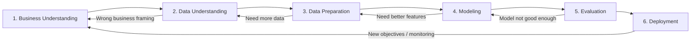

# CTV 041 / CSCT3106 — Data Analytics with AWS
## PYQ-Based Study Material (End-Sem 2024–25) — Detailed Notes (Extended)

**How to use this guide (fast):**
- Read **Unit 4 (CRISP‑DM + Data Mining + ML)** carefully; it’s heavily asked.
- Use the **“PYQ Answer Bank”** section for 4/6/10/12‑mark exam writing.
- For AWS questions, memorize the **“AWS analytics pipeline”** and map services to steps.

> Printing note: Page count depends on font + margins. This guide is intentionally long; exporting to PDF from VS Code Markdown preview (Print) should typically give **~20+ pages** with standard settings.

---

## Table of contents
1. [Unit 1 — Business Analytics (BA) & Optimization (BAO)](#unit-1--business-analytics-ba--optimization-bao)
2. [Unit 2 — Data Warehouse + Data Marts + OLAP + BI users](#unit-2--data-warehouse--data-marts--olap--bi-users)
3. [Unit 3 — Business Intelligence (BI) + BI tools + BI project steps](#unit-3--business-intelligence-bi--bi-tools--bi-project-steps)
4. [Unit 4 — Data Mining + CRISP‑DM + KDD + Feature Selection + ML](#unit-4--data-mining--crisp-dm--kdd--feature-selection--ml)
5. [Unit 5 — Analytics with AWS: Storage, Athena, Cleaning/Processing/Querying, CloudTrail, Visualization](#unit-5--analytics-with-aws-storage-athena-cleaningprocessingquerying-cloudtrail-visualization)
6. [PYQ Answer Bank (Section‑A/B/C/D mapped)](#pyq-answer-bank-section-abcd-mapped)
7. [Quick Revision (Last‑Minute 3–4 pages)](#quick-revision-last-minute-34-pages)

---

## What examiners usually want (pattern)
- **4 marks**: definition + 6–8 crisp points.
- **6 marks**: definition + diagram/flow + 8–12 points + 1 example.
- **10/12 marks**: definition + layered explanation + diagram + comparison table + real-world example + conclusion.

## Must-practice diagrams (draw from memory)
- BI architecture (sources → ETL → DW/Lake → OLAP/semantic → dashboards)
- Data warehouse star schema
- OLTP vs OLAP table
- KDD steps
- **CRISP‑DM cycle with feedback loops**
- AWS analytics pipeline (ingest → store → catalog → process → query → visualize → monitor)

---

# Unit 1 — Business Analytics (BA) & Optimization (BAO)

## 1.1 What is Business Analytics?
**Business Analytics (BA)** is the use of data, statistics, and models to support business decisions.

### Types of analytics (very important)
1. **Descriptive**: *What happened?* (reports, dashboards, KPIs)
2. **Diagnostic**: *Why did it happen?* (drill-down, root cause analysis)
3. **Predictive**: *What will happen?* (forecasting, ML models)
4. **Prescriptive**: *What should we do?* (optimization, simulation, recommendations)

### Example (same business problem, different analytics)
**Problem**: A store’s profits dropped.
- Descriptive: profit trend chart shows drop in last 2 months.
- Diagnostic: drill-down shows drop mainly in one category + one region.
- Predictive: model forecasts next month profit if trend continues.
- Prescriptive: optimization suggests pricing + inventory changes to maximize profit.

---

## 1.2 Why is BAO needed now? ("3 V" + decision pressure)
Modern businesses face:
- **Volume**: huge data size (GB → TB → PB)
- **Variety**: structured + semi‑structured + unstructured data
- **Velocity**: fast data generation + need for fast decisions

**BAO (Business Analytics and Optimization)** adds decision‑making methods on top of analytics—especially prescriptive/optimization.

---

## 1.3 Challenges of implementing analytics in a business environment
This is a direct PYQ topic.

### A. Data challenges
- **Data silos**: data scattered across departments
- **Poor data quality**: missing values, duplicates, inconsistent formats
- **Lack of standards**: different definitions of the same KPI (e.g., “active user”)
- **Integration difficulty**: many systems (ERP/CRM/web/apps)

### B. Technology challenges
- **Tool sprawl**: too many tools; no standard platform
- **Scalability**: system becomes slow with growth
- **Security & privacy**: access control, encryption, compliance
- **Legacy systems**: old databases, limited APIs

### C. People & process challenges
- **Skill gap**: lack of analysts/data engineers
- **Low adoption**: dashboards exist but not used
- **Change management**: resistance to data‑driven culture
- **Unclear ownership**: who owns data/KPIs?

### D. Business challenges
- **Unclear objectives**: analytics without business questions
- **ROI uncertainty**: benefits hard to measure early
- **Time-to-value**: long projects lose stakeholder interest

**Exam tip (4 marks):** write 8–10 bullets across data/tech/people/business.

---

## 1.4 Building blocks for a successful analytics program
A strong analytics program usually needs:
- **Fact-based decision culture** (leaders ask for evidence)
- **Strong data infrastructure** (data lake/warehouse, pipelines)
- **Right tools** (BI + ETL + ML + governance)
- **Analytics workforce** (business analyst, data engineer, data scientist)
- **Governance** (standards, definitions, quality checks, security)

---

## 1.5 Analytics maturity model (PYQ)
An **analytics maturity model** shows how an organization evolves from basic reporting to advanced predictive/prescriptive decisioning.

### Common 5-level maturity model (easy to remember)
1. **Ad hoc / Local**
   - spreadsheets, manual reports, inconsistent KPIs
2. **Standardized reporting**
   - basic dashboards, common definitions start
3. **Integrated analytics**
   - data warehouse/lake, ETL pipelines, self-service BI
4. **Predictive analytics**
   - forecasting, ML models, experimentation (A/B tests)
5. **Prescriptive/Optimized (data-driven enterprise)**
   - optimization, automation, real-time decisions, continuous monitoring

### What changes as maturity increases?
- **Data**: from fragmented → governed single source of truth
- **Tools**: from Excel → BI platform → ML + MLOps
- **People**: from few analysts → cross-functional analytics teams
- **Decision process**: intuition-first → evidence-first → automation where safe

### IBM-style view (often referenced)
Some curricula mention “IBM Business Analytics Maturity Model”. Even if you don’t remember exact IBM labels, write the *idea*: maturity stages + capabilities + governance.

**Good 10-mark structure:** definition → levels → indicators of each level → benefits → how to move up.

---

## 1.6 Roles: Business Analyst vs Data Scientist vs Data Engineer
### Business Analyst (BA) — business + requirements
- Understand business domain and processes
- Gather requirements; define KPIs
- Translate business problem into analytics questions
- Communicate insights to stakeholders

### Data Scientist — modeling + experimentation
- Build predictive models (ML)
- Feature engineering, evaluation, tuning
- Interpret results and business impact

### Data Engineer — pipelines + reliability
- Build ETL/ELT pipelines
- Design data lake/warehouse tables
- Data quality checks, orchestration, monitoring

**Where to place analytics team?**
- Centralized (shared analytics COE) or decentralized (embedded in departments) or hybrid.

---

## 1.7 Use of Business Analysis (PYQ: “Show the use of Business Analysis”)

Many students confuse **Business Analysis** and **Business Analytics**:
- **Business Analysis**: *understand the business problem* and define **requirements** and **solutions**.
- **Business Analytics**: *use data + models* to generate insights/predictions for decisions.

### Where business analysis is used
Business analysis is used in:
- **Software/IT projects**: building ERP/CRM modules, BI dashboards, analytics platforms
- **Process improvement**: reducing delays, removing bottlenecks, improving quality
- **Strategy & planning**: new product, market entry, pricing policy
- **Data/analytics projects**: defining KPIs, data definitions, acceptance criteria, and success metrics

### Typical business analysis activities (exam-ready)
1. **Problem/opportunity identification**
   - What is happening? Why is it a problem? Who is affected?
2. **Stakeholder analysis**
   - Identify stakeholders and their needs (management, users, IT, customers).
3. **As‑Is process understanding**
   - Map current process (flowcharts, swimlane diagrams).
4. **Gap analysis**
   - Compare As‑Is vs To‑Be; find gaps in process, data, controls.
5. **Requirements engineering**
   - Functional requirements (what system does)
   - Non-functional (performance, security, availability)
   - Data requirements (fields, definitions, quality rules)
6. **Solution evaluation and selection**
   - Compare options by cost, feasibility, risk, expected benefit.
7. **Acceptance criteria and validation**
   - Define “done”: KPI targets, report correctness, model performance thresholds.

### Small example (simple and clear)
**Problem:** “Customer complaints are increasing.”
- Business analysis: identifies cause (late deliveries), defines KPIs (on-time %), gathers requirements for a dashboard + alerting.
- Business analytics: predicts late deliveries using shipment + traffic data.

---

## 1.8 Optimization basics (BAO)

Optimization is the “prescriptive” part of analytics: it chooses the **best** decision.

### Key terms
- **Decision variables**: what you control (e.g., price, number of staff)
- **Objective function**: what you maximize/minimize (profit, cost, time)
- **Constraints**: limits (budget, capacity, rules)

### Generic optimization form
Maximize/Minimize:
\[
	ext{Objective}(x) \quad \text{subject to constraints on } x
\]

### Mini example (write in exam)
**Maximize profit** by selecting production quantities:
- Variables: $x_1, x_2$ = units of Product‑1 and Product‑2
- Objective: maximize $P = 40x_1 + 30x_2$
- Constraints:
  - Machine hours: $2x_1 + 1x_2 \le 100$
  - Labor hours: $1x_1 + 1x_2 \le 80$
  - $x_1, x_2 \ge 0$

### Common optimization types (names only are enough)
- **Linear Programming (LP)**: linear objective + constraints
- **Integer Programming (IP)**: variables must be integers (e.g., number of trucks)
- **Constraint Optimization**: many logical/business rules
- **Simulation + optimization**: test scenarios, then choose best

---

## 1.9 High-level architecture of BAO (reference architecture idea)

Examiners often want a **layered architecture** showing how data becomes decisions.

```text
Data Sources
 (ERP/CRM, Web, IoT, Logs)
        |
        v
Data Integration (ETL/ELT)
 + Data Quality + Metadata
        |
        v
Analytics Data Store
 (Data Warehouse / Data Lake / Data Marts)
        |
        +---------------------+
        |                     |
        v                     v
Descriptive/Diagnostic     Predictive/Prescriptive
(BI/OLAP/Reports)          (ML models + Optimization)
        |                     |
        +----------+----------+
                   v
         Decision & Action Layer
      (Dashboards, Alerts, Automation)

Across all layers: Governance, Security, Monitoring
```

### Why “reference architecture” matters
- Gives a **standard blueprint** so teams build consistent solutions.
- Clarifies responsibilities (data engineering vs BI vs data science).
- Helps with scalability, security, and maintainability.


---

# Unit 2 — Data Warehouse + Data Marts + OLAP + BI users

## 2.1 Decision Support Systems (DSS) and 3-tier view
A DSS supports decisions by combining data + models + UI.

**3-tier DSS (classic):**
1. **Presentation layer**: dashboards/reports
2. **Logic/analysis layer**: OLAP, analytics, business rules
3. **Data layer**: warehouse, marts, operational data

---

## 2.2 What is a Data Warehouse? (DW)
A **Data Warehouse** is a centralized repository designed for **analysis and reporting**, usually containing **integrated, historical, subject-oriented** data.

### Key characteristics
- **Subject-oriented** (sales, finance, customers)
- **Integrated** (consistent naming, units, keys)
- **Time-variant** (stores history)
- **Non-volatile** (stable, mainly read/append)

### Why DW exists
Operational DBs are built for transactions (OLTP). Analytics needs fast queries over history (OLAP). DW bridges that.

---

## 2.3 Data Warehouse architectures (PYQ related)
### A. Enterprise Data Warehouse (EDW)
One central warehouse for the whole organization.
- Pros: single source of truth
- Cons: longer to build; higher cost

### B. Independent Data Mart
Each department builds its own mart.
- Pros: faster to start
- Cons: inconsistent KPIs; duplicate data

### C. Dependent Data Mart
Data marts are created from EDW.
- Best of both: EDW truth + department-specific views

---

## 2.4 Data Mart (PYQ) and how it differs from DW
A **Data Mart** is a smaller, department-focused subset of data (e.g., only Sales).

### Differences (high scoring table)
| Feature | Data Warehouse | Data Mart |
|---|---|---|
| Scope | Enterprise-wide | Department/subject-specific |
| Size | Large | Smaller |
| Build time | Long | Shorter |
| Data sources | Many | Fewer (often from DW) |
| Governance | Stronger (ideally) | Can be weaker if independent |
| Purpose | Organization-wide analytics | Local analytics needs |

**Exam line:** “A DW is the big central library; a data mart is a department bookshelf.”

---

## 2.5 Multidimensional data + OLAP basics
**OLAP (Online Analytical Processing)** supports fast, interactive analysis using multidimensional structures.

### OLTP vs OLAP (must know)
| OLTP | OLAP |
|---|---|
| Many small transactions | Fewer, heavy queries |
| Current data | Historical + aggregated |
| Highly normalized | Often denormalized/star schema |
| Write-heavy | Read-heavy |
| Example: order entry | Example: sales trend analysis |

### Data cube
A **cube** organizes data by dimensions (time, region, product) and measures (sales, profit).

Operations:
- **Slice** (fix one dimension)
- **Dice** (select a sub-cube)
- **Drill-down / roll-up** (detail ↔ summary)
- **Pivot** (rotate dimensions)

---

## 2.5.1 Data warehouse usage (what DW is used for)
Common uses of DW in organizations:
- **Trend analysis**: sales growth over years
- **Performance management**: KPI dashboards for managers
- **Budgeting and forecasting**: compare actual vs target
- **Customer analytics**: CLV, churn, segmentation
- **Compliance reporting**: standardized reports across departments

### Information pyramid (easy 4 marks)
```text
       Decisions (Strategic)
          /\
         /  \
    Analytics / BI (Tactical)
       /\
      /  \
   Data warehouse / marts (Integrated)
      /\
     /  \
Operational data (Transactions)
```

Idea: **as you move up**, data becomes more summarized and more decision-oriented.

---

## 2.6 Data warehouse design process (exam-ready)

### Step-by-step DW design (Kimball-style practical view)
1. **Requirements**: identify business processes and KPIs (sales, inventory, etc.)
2. **Choose the grain**: define what one row in the fact table represents
   - Example: “one row per product per store per day”
3. **Identify dimensions**: who/what/when/where (Customer, Product, Time, Store)
4. **Identify facts/measures**: sales amount, quantity, profit
5. **Design star schema**: fact table + dimension tables
6. **ETL/ELT design**: extract sources, clean, conform dimensions
7. **Build aggregates/cubes** (optional): speed up common queries
8. **Validate**: reconciliation with source totals, sampling checks
9. **Performance tuning**: partitions, indexes, materialized views
10. **Governance**: metadata, security, data quality rules

### Grain (most important concept)
**Grain** decides the detail level.
- Finer grain (per transaction) → bigger data but more flexibility
- Coarser grain (per day) → smaller but fewer drill-down options

---

## 2.7 Data warehouse architectures (single/two/three tier)
You may see these names in notes:

### A) Single-layer architecture
- Users query operational DB directly.
- Not recommended for analytics at scale (performance + data inconsistency).

### B) Two-layer architecture
- Operational sources → DW → BI tools.
- Works, but can be limited without staging/ODS.

### C) Three-tier / multi-tier architecture (most common)
```text
Sources → Staging/ODS → DW/Data Lake → OLAP/Semantic → BI tools
```
- **Staging/ODS**: temporary landing zone for ETL and quality checks.
- **DW**: integrated historical store.
- **OLAP/Semantic**: optimized layer for user queries.

---

## 2.8 OLAP server architectures (PYQ-supporting)
OLAP can be implemented in different ways:

### ROLAP (Relational OLAP)
- Stores data in relational tables (star schemas) and uses SQL.
- Pros: scales well with large data.
- Cons: complex aggregations may be slower.

### MOLAP (Multidimensional OLAP)
- Stores pre-aggregated data in cube structures.
- Pros: very fast queries.
- Cons: cube build time, storage, less flexible.

### HOLAP (Hybrid)
- Mix of ROLAP + MOLAP.
- Aggregates in cube, detail in relational store.

---

## 2.9 Dashboards vs scorecards (often asked indirectly)

### Dashboard
- Shows **current status** using charts/KPIs.
- Focus: monitoring.

### Scorecard
- Shows performance **against targets** (plan vs actual).
- Focus: management/strategy alignment.

Typical scorecard idea:
- KPI: “On-time delivery”
- Target: 95%
- Actual: 91% → status: red

---

## 2.10 Metadata model (what is metadata in BI/DW?)
**Metadata** = “data about data”. It helps users and tools understand meaning.

### Types of metadata
- **Technical metadata**: table/column names, types, lineage
- **Business metadata**: KPI definitions, owners, data dictionary
- **Operational metadata**: refresh times, job logs, data quality results

Why it matters:
- Ensures consistent reporting
- Supports governance and auditing
- Helps troubleshooting and impact analysis

---

## 2.11 Automated tasks/events + Real-time monitoring
Modern BI systems automate:
- Scheduled refresh of datasets and dashboards
- Threshold alerts (e.g., sales drop below limit)
- Data quality checks (missing values spike)
- Pipeline failure notifications

Real-time monitoring uses streaming/near real-time data to update KPIs quickly.

---

## 2.12 Disconnected BI (offline BI)
**Disconnected BI** means users can access reports when not connected (e.g., during travel).

Common approach:
- Download cached reports or extracts
- Sync when connectivity returns

Challenges:
- Data freshness
- Security on local devices

---

## 2.13 Dimensional modeling schemas (star/snowflake)
### Star schema (most common)
- One **fact table** (measures) linked to multiple **dimension tables**
- Easy queries, good performance

### Snowflake schema
- Dimensions further normalized
- Saves storage but increases join complexity

### Fact constellation
- Multiple fact tables share dimension tables

---

## 2.14 BI reporting tool architectures + BI consumption
BI tools can connect to:
- DW/DM directly (SQL)
- OLAP cubes
- Semantic layer (business-friendly model)

### Mobile BI and Collaborative BI (PYQ)
**Mobile BI**: BI access on phones/tablets.
- Benefits: decisions anywhere, faster response, field teams
- Challenges: security, small screen design, offline needs

**Collaborative BI**: people discuss insights in context.
- Examples: comments on dashboards, sharing annotated reports
- Benefits: single version of truth + faster alignment

### Importance (good answer points)
- Reduces decision latency
- Encourages data-driven culture
- Improves coordination across teams
- Enables real-time monitoring and alerts

---

## 2.15 Types of BI users (PYQ)
Common classification (write 6–8 types):
- **Executives**: high-level KPIs, strategy dashboards
- **Managers**: operational dashboards, drill-down
- **Business analysts / power users**: ad hoc analysis, advanced visuals
- **Operational users**: daily reports, alerts
- **IT/BI developers**: manage data models, ETL, governance
- **External users/partners**: limited access reporting

Alternate view (simple): **Casual users** vs **Power users** vs **IT administrators**.

---

# Unit 3 — Business Intelligence (BI) + BI tools + BI project steps

## 3.1 What is Business Intelligence (BI)?
**BI** is the set of processes, tools, and architectures that transform raw business data into meaningful information for decisions.

BI typically includes:
- Data integration (ETL/ELT)
- Data storage (DW/Lake)
- Analysis (OLAP, queries)
- Reporting/visualization (dashboards)

---

## 3.2 Sample BI architecture (high scoring)
```text
Data Sources (ERP/CRM/Web/Files)
        |
        v
ETL / ELT + Data Quality
        |
        v
Data Warehouse / Data Lake
        |
  +-----+-----+
  |           |
Data Marts   OLAP / Semantic Layer
  |           |
  +-----+-----+
        |
        v
BI Tools (Reports/Dashboards)
        |
        v
Decision Makers
```

### Component explanation (write in exam)
- **Data sources**: operational DBs, logs, IoT, third-party
- **ETL/ELT**: cleanse/transform/standardize
- **DW/Lake**: single place for analytics
- **Marts/semantic layer**: business-friendly view
- **BI tools**: dashboards, scorecards, reporting

---

## 3.2.1 Why BI is getting more complex (syllabus: “Things are getting more complex”)
Modern BI is harder than older reporting systems because:
- Data is huge (volume) and comes in many formats (variety).
- Data arrives faster (velocity) and businesses expect near real-time views.
- Data lives across on‑prem + cloud + SaaS → integration becomes difficult.
- Security and privacy requirements are stricter.

Practical meaning: BI is no longer only “make reports”. It includes **data engineering, governance, real-time pipelines, and advanced analytics**.

---

## 3.2.2 BI components and architecture (expanded)
A complete BI system typically contains:
- **Data sources**: ERP/CRM, databases, files, APIs, logs
- **Integration layer**: ETL/ELT, data quality rules, deduplication
- **Storage layer**: data warehouse/data lake/data marts
- **Semantic layer / OLAP**: business-friendly metrics and dimensions
- **Analytics layer**: OLAP, data mining, ML, forecasting
- **Presentation layer**: dashboards, reports, mobile BI
- **Governance & security**: metadata, lineage, access control, auditing

Why architecture matters:
- ensures consistent KPIs (“single version of truth”)
- improves performance and scalability
- makes BI maintainable and secure

---

## 3.2.3 Scope and fit of BI solutions within existing infrastructure
When an organization adopts BI, it must “fit” into existing systems.

Key questions:
- **Where is the source data?** (on‑prem DBs, SaaS tools, cloud)
- **How will data move?** (batch vs streaming)
- **Who will use BI?** (executives, managers, analysts, operational users)
- **Security model?** (role-based access, row-level security)
- **Performance needs?** (daily reports vs real-time dashboards)
- **Governance?** (data definitions, ownership, lineage)

Common failure pattern:
“Dashboard looks good, but numbers don’t match finance.”
Root cause is usually **definitions + governance**, not charts.

---

## 3.2.4 High-level BI process (syllabus: “High Level BI Process”)

```text
Define goals/KPIs
   |
   v
Collect + integrate data (ETL/ELT)
   |
   v
Store + model (DW/lake + semantic layer)
   |
   v
Analyze (OLAP, ad hoc queries, mining)
   |
   v
Deliver (reports/dashboards/alerts)
   |
   v
Monitor + improve (feedback + governance)
```

---

## 3.2.5 Functional areas of a BI tool (what BI tools usually provide)
Most BI platforms support:
- **Reporting** (scheduled and pixel-perfect reports)
- **Dashboards** (interactive KPI views)
- **Ad hoc analysis** (drag-drop, drill-down)
- **Self-service data prep** (basic transformations)
- **Semantic modeling** (metrics definitions)
- **Security** (roles, row-level security)
- **Sharing/collaboration** (comments, subscriptions)
- **Mobile BI** (optimized views)

Some advanced platforms add:
- **Data mining / forecasting**
- **Performance management** (scorecards)
- **Embedded analytics** (inside apps)

---

## 3.3 Benefits of BI
- Faster and better decisions
- Better performance monitoring (KPIs)
- Identify trends + opportunities
- Reduce cost via process optimization
- Improve customer experience

---

## 3.3.1 Maximize value from BI systems (common exam writing points)
To get real value from BI, organizations should:
- Define a **BI strategy** aligned to business goals
- Standardize KPIs and build a **semantic layer**
- Provide training and promote adoption (self-service with governance)
- Keep a small number of “official” dashboards (avoid duplicates)
- Measure ROI (time saved, revenue uplift, reduced waste)
- Continuously improve using user feedback

---

## 3.3.2 Strategy and BI + business transformation
BI supports transformation by:
- Making performance visible (KPIs)
- Enabling faster corrective actions
- Supporting process redesign with evidence

### Business role of BI (TDWI-style view)
- **Strategic**: long-term planning (market expansion)
- **Tactical**: department improvements (inventory planning)
- **Operational**: day-to-day monitoring (daily orders, service levels)

---

## 3.3.3 BI maturity (ASUG model) + scorecards
The **ASUG BI Maturity Model** is often taught as 5 levels:
1. **Basic reporting** (static reports)
2. **Managed BI** (department BI, some governance)
3. **Enterprise BI** (integrated org-wide BI)
4. **Predictive analytics** (forecasting/mining)
5. **Optimized BI** (data-driven + continuous improvement)

### BI Effectiveness Scorecard (what to measure)
- Data accuracy/quality
- User satisfaction/adoption
- Decision speed (time to insight)
- System performance (refresh time, uptime)
- ROI/value delivered

### BI Value Scorecard (business value areas)
- Financial benefits (profit/cost)
- Operational efficiency
- Customer satisfaction
- Innovation capability

---

## 3.3.4 Five key areas of strategy (easy 4–6 marks)
1. **Customer strategy**: retention, satisfaction
2. **Financial strategy**: revenue, margin
3. **Operational strategy**: efficiency, quality
4. **Innovation strategy**: new products/services
5. **Technology strategy**: cloud, automation, BI tools

---

## 3.4 Common BI tools and their uses (PYQ)
Write 6–10 tools + 1–2 lines each.

### Popular tools
- **Microsoft Power BI**: dashboards, DAX modeling, Microsoft ecosystem
- **Tableau**: strong visualization and interactive exploration
- **Qlik (Sense/View)**: associative analytics, fast exploration
- **Looker (Google)**: semantic modeling (LookML), governed metrics
- **SAP BusinessObjects** / **IBM Cognos** / **MicroStrategy**: enterprise reporting
- **SAS BI**: analytics + reporting (often in regulated domains)
- **Apache Superset / Metabase**: open-source BI
- **Amazon QuickSight**: AWS-native BI, SPICE cache, embedding

### What examiners like
Also mention:
- Reporting, dashboards, ad hoc analysis
- Scheduling + distribution
- Data governance/semantic layer
- Mobile & collaboration

---

## 3.5 Steps of a BI project (PYQ)
A good BI project answer looks like a lifecycle.

### BI project lifecycle (8–10 steps)
1. **Problem definition & goals** (business objectives, KPIs)
2. **Stakeholder interviews & requirement gathering**
3. **Data audit** (sources, quality, gaps)
4. **Architecture & tool selection** (DW/lake, BI tool)
5. **Data modeling** (dimensional model, semantic layer)
6. **ETL/ELT development** (pipelines + quality rules)
7. **Dashboard/report development** (UX + KPIs)
8. **Testing** (data validation, performance, UAT)
9. **Deployment & training** (rollout, adoption plan)
10. **Operations** (monitoring, governance, change requests)

**For 6 marks:** write 6–8 steps.
**For 10 marks:** add governance + risk + cost + success metrics.

---

## 3.5.1 Planning a BI project: pre-engagement vs engagement

### Pre-engagement activities
- Identify business sponsor and primary stakeholders
- Clarify business goals and KPIs
- Initial data/source assessment (availability + quality)
- Decide feasibility, scope, and timeline

### Engagement activities
- Detailed requirements workshops
- Architecture + tool decisions
- Detailed project plan (milestones, roles)
- Build proof of concept (POC) if needed

---

## 3.5.2 Detailed BI project tasks (syllabus Task 1–10)

These tasks are good for a **10-mark** answer because they show project depth.

1. **Task 1 — Knowledge capture goals**
   - discuss business objectives, learn current pain points
   - interview key stakeholders
   - project planning
2. **Task 2 — Consolidate findings**
   - create logical design, consolidate definitions
3. **Task 3 — Map the customer situation**
   - document current environment
   - gather business/functional requirements
   - draw a logical BI diagram
4. **Task 4 — Methodology & approach**
   - choose development approach (agile/incremental)
5. **Task 5 — Standards & governance**
   - KPI definitions, data dictionary, access control, naming standards
6. **Task 6 — Sections, milestones and tasks**
   - timeline + deliverables
7. **Task 7 — Proof of concept (POC)**
   - validate feasibility (data availability, performance)
8. **Task 8 — Table creation**
   - DW tables (facts/dimensions), conformed dimensions
9. **Task 9 — OLAP creation**
   - cubes/semantic model
10. **Task 10 — Final deliverables**
   - dashboards/reports, training, documentation

---

## 3.5.3 Risk management and mitigation (add to 10 marks)
Common BI risks:
- poor data quality
- scope creep
- low adoption
- performance issues
- security/privacy failures

Mitigation:
- data profiling early
- clear KPI definitions + governance
- phased delivery with feedback
- performance testing + caching strategies
- IAM roles + auditing

---

## 3.5.4 Cost justification and measuring success
Ways to justify BI cost:
- time saved per analyst/user
- reduced manual reporting
- better decisions (less stockouts, better pricing)
- compliance reporting automation

Measuring success:
- adoption metrics (active users)
- refresh reliability
- KPI accuracy
- business impact (profit, cost, churn)

---

# Unit 4 — Data Mining + CRISP‑DM + KDD + Feature Selection + ML

## 4.1 What is Data Mining?
**Data Mining** is the process of discovering **patterns, relationships, and useful knowledge** from large datasets.

It sits inside a bigger process:
- **KDD (Knowledge Discovery in Databases)** = end-to-end knowledge discovery
- **Data mining** = the modeling/pattern discovery step inside KDD

---

## 4.1.1 Evolution of data mining (easy 4 marks)
Data mining evolved because:
- Organizations started storing huge transaction data (POS, banking, telecom).
- Traditional reporting answered “what” but not “what will happen” or “why”.
- Cheaper storage + faster computing enabled advanced algorithms.

Typical evolution chain:
```text
Data Collection → Databases → Data Warehouses → OLAP/BI → Data Mining → Machine Learning/AI
```

---

## 4.1.2 Data mining vs statistics vs BI (common confusion)
- **BI/Reporting**: summarizes known metrics (sales, profit).
- **Statistics**: inference/estimation, hypothesis testing, sampling.
- **Data mining**: pattern discovery + predictive modeling on large datasets.

In exam writing, you can say:
“BI describes; data mining discovers patterns; ML predicts/learns models.”

---

## 4.2 Why data mining? (business motivation)
- Detect fraud
- Segment customers
- Recommend products
- Predict churn
- Optimize operations

---

## 4.2.1 On what kinds of data can data mining be done? (syllabus)
Data mining can be applied to:
- **Relational/transaction data** (sales, banking)
- **Data warehouse data** (integrated historical)
- **Time series** (stock prices, sensor data)
- **Spatial data** (GIS, location)
- **Text** (reviews, emails, social media)
- **Web and clickstream data** (page views, sessions)
- **Multimedia** (images, audio) — usually via ML techniques

Exam line:
“Modern data mining is not limited to tables; it also includes text, web logs, and streams.”

---

## 4.3 Data mining tasks (must list)
- **Classification**: assign labels (spam/not spam)
- **Regression**: predict numeric value (sales forecast)
- **Clustering**: group similar items (customer segments)
- **Association rule mining**: “people who buy X also buy Y”
- **Anomaly detection**: rare unusual patterns (fraud)
- **Text mining**: sentiment, topic extraction

---

## 4.3.1 Components of a data mining method (high-quality answer)
A data mining method/algorithm typically has:
- **Data representation**: how data is represented (features, vectors, categories)
- **Model/Pattern representation**: decision tree, rules, clusters, regression equation
- **Search/learning procedure**: how it finds the model (greedy split, gradient descent)
- **Scoring/evaluation**: objective/metric (accuracy, RMSE, support/confidence)
- **Validation strategy**: train/test split, cross-validation

This is how you show “components of DM methods” in exams.

---

## 4.3.2 Data mining techniques (what to list in answers)
Below is a safe list you can write (names + 1 line):

### Classification techniques
- **Decision Tree**: rule-like splits; interpretable
- **Naive Bayes**: probability-based; fast for text
- **k-NN**: classify using nearest examples
- **Logistic Regression**: linear classifier; good baseline
- **SVM**: margin-based; good for high-dimensional data

### Regression techniques
- **Linear Regression**: simple numeric prediction
- **Tree/Random Forest regression**: handles non-linear relations

### Clustering techniques
- **k-means**: partitions into k clusters
- **Hierarchical clustering**: tree of clusters

### Association rules
- **Apriori / FP-Growth**: market basket patterns

### Dimensionality reduction
- **PCA**: reduce features while keeping variance

### Anomaly detection
- Statistical thresholding, clustering-based, isolation methods

---

## 4.3.3 Real-world applications of data mining (Section‑B PYQ)
Write industry + application; 6 marks = ~6 industries.

- **Retail/E-commerce**: market basket analysis, recommendations
- **Banking/Finance**: fraud detection, credit scoring
- **Telecom**: churn prediction, network fault detection
- **Healthcare**: disease risk prediction, patient segmentation
- **Manufacturing**: predictive maintenance (sensor anomaly detection)
- **Education**: performance prediction, dropout risk
- **Government**: tax fraud detection, resource planning

---

## 4.4 Challenges of Data Mining (PYQ)
Write in categories for a strong answer.

### A. Data quality and preparation
- Missing values, noisy data, outliers
- Duplicates and inconsistent formats
- Data integration from multiple sources

### B. Scale and performance
- Very large datasets: need distributed processing
- High dimensionality (many features)
- Real-time/streaming requirements

### C. Heterogeneity
- Structured + unstructured data (text/images/logs)
- Different schemas and evolving data

### D. Evaluation difficulty
- Choosing correct metrics (accuracy vs precision/recall)
- Data leakage problems
- Models may not generalize

### E. Interpretability
- Black-box models hard to explain
- Business needs explainable decisions

### F. Privacy, security, ethics
- Sensitive data, consent, compliance
- Bias/fairness issues

---

## 4.4.1 “Why machine should learn?” (syllabus)
Rule-based systems (“if-else rules”) fail at scale because:
- rules are hard to maintain as data grows and changes
- patterns are complex and non-linear
- manual rules miss hidden interactions
- environments drift (customer behavior changes)

Machines should learn because ML models can:
- adapt from data
- improve with more examples
- generalize to new cases

Example:
- Rule-based spam filter: fails when spammers change words.
- ML spam filter: learns patterns from new labeled emails.

---

## 4.5 KDD process model (classic steps)
KDD is often shown as:
1. **Selection** (choose data relevant to goal)
2. **Preprocessing** (cleaning)
3. **Transformation** (feature engineering)
4. **Data Mining** (apply algorithms)
5. **Interpretation/Evaluation** (convert patterns to knowledge)

### KDD diagram (exam-friendly)
```text
Data Sources
   |
   v
Selection -> Preprocessing -> Transformation -> Data Mining -> Interpretation/Evaluation
```

---

## 4.6 CRISP‑DM (PYQ) — explained crystal clearly
**CRISP‑DM** = **Cross Industry Standard Process for Data Mining**.
It is a practical, widely used lifecycle for analytics/data mining projects.

### Why CRISP‑DM is important
- Provides a **repeatable method** (not random modeling)
- Forces alignment with **business objectives**
- Emphasizes **iteration** (you often go back and refine)

---

## 4.6.1 CRISP‑DM phases (6 phases)
1. **Business Understanding**
2. **Data Understanding**
3. **Data Preparation**
4. **Modeling**
5. **Evaluation**
6. **Deployment**

### CRISP‑DM cycle diagram (not just arrows — shows iteration)


If Mermaid doesn’t render in your viewer, remember the key idea: **CRISP‑DM is a loop**. You often move backward.

---

## 4.6.2 Phase-by-phase deep explanation (what to write in exams)

### 1) Business Understanding
**Goal:** convert a business problem into a data mining problem.

**Typical activities:**
- Understand business context (industry, process, constraints)
- Define objectives (e.g., reduce churn by 10%)
- Define success criteria (KPIs, acceptable error, ROI)
- Create project plan (scope, timeline, risks)

**Deliverables:**
- Problem statement
- Success metrics
- Assumptions/constraints
- Project plan

**Common mistakes:**
- Vague goals (“improve sales”) without measurable KPIs
- Building a model without knowing how it will be used

**Example:**
- Business goal: “Reduce credit card fraud loss.”
- Data mining goal: “Build anomaly detection model with precision ≥ X at recall ≥ Y.”

---

### 2) Data Understanding
**Goal:** collect initial data and learn what it contains.

**Typical activities:**
- Identify data sources (DBs, logs, files)
- Collect sample datasets
- Describe data (schema, types, distributions)
- Explore data (EDA)
- Verify data quality issues (missing values, outliers)

**Deliverables:**
- Data description report
- Data quality report
- Initial hypotheses

**Common mistakes:**
- Assuming data is correct without profiling
- Ignoring target leakage (features that “cheat”)

---

### 3) Data Preparation (usually the longest phase)
**Goal:** create a final dataset ready for modeling.

**Typical activities:**
- Select relevant records/fields
- Clean data (missing values, duplicates)
- Construct new features (feature engineering)
- Transform data (scaling, encoding)
- Integrate multiple datasets (joins)
- Split dataset (train/validation/test)

**Deliverables:**
- Final modeling dataset
- Data preparation pipeline (repeatable)

**Common mistakes:**
- Cleaning steps not reproducible
- Data leakage due to wrong splitting (e.g., time series)

---

### 4) Modeling
**Goal:** choose and train modeling techniques.

**Typical activities:**
- Select algorithm type (classification/regression/etc.)
- Train models
- Hyperparameter tuning
- Cross-validation
- Compare models

**Deliverables:**
- Candidate models
- Model parameters
- Training evaluation results

**Common mistakes:**
- Optimizing only one metric (accuracy) when business needs another (precision)

---

### 5) Evaluation
**Goal:** check whether the model meets business objectives.

**Typical activities:**
- Evaluate on holdout set
- Validate assumptions
- Perform error analysis
- Check fairness/bias
- Determine if it solves the business question

**Deliverables:**
- Evaluation report
- Go/no-go decision

**Common mistakes:**
- Good ML metrics but no business value
- Ignoring cost of false positives/negatives

---

### 6) Deployment
**Goal:** put the model/insights into real use.

**Deployment types:**
- **Report deployment**: deliver dashboards/insights
- **Batch scoring**: run model daily/weekly
- **Real-time API**: serve predictions instantly

**Operational activities:**
- Monitoring model performance (drift)
- Retraining strategy
- Documentation
- Security and access

**Deliverables:**
- Deployed model/report
- Monitoring plan
- Maintenance plan

**Common mistakes:**
- No monitoring → model degrades silently over time

---

## 4.6.4 CRISP‑DM “Elaborate view” (what happens inside each phase)

Many papers ask “Elaborate CRISP‑DM”. The best answer shows **sub‑tasks**.

### Phase 1: Business Understanding — typical tasks
- Determine business objectives
- Assess situation (resources, constraints, risks)
- Determine data mining goals
- Produce project plan

### Phase 2: Data Understanding — typical tasks
- Collect initial data
- Describe data
- Explore data (EDA)
- Verify data quality

### Phase 3: Data Preparation — typical tasks
- Select data (tables/fields)
- Clean data (missing/outliers/duplicates)
- Construct data (new features)
- Integrate data (joins)
- Format data (final dataset)

### Phase 4: Modeling — typical tasks
- Select modeling technique
- Generate test design
- Build model
- Assess model

### Phase 5: Evaluation — typical tasks
- Evaluate results vs business objectives
- Review process
- Determine next steps

### Phase 6: Deployment — typical tasks
- Plan deployment
- Plan monitoring and maintenance
- Produce final report
- Review project

**Exam tip:** write tasks + outputs (reports, datasets, trained model, deployment plan).

---

## 4.6.5 Worked example (full CRISP‑DM) — Customer churn prediction

This kind of example makes your 10-mark answers “complete”.

### Business Understanding
- Objective: reduce churn by 5% in 3 months.
- Success metric: recall high churn customers while controlling false positives.
- Constraints: marketing budget; cannot spam all users.

### Data Understanding
- Sources: customer profile table, usage logs, billing/payment history, complaint tickets.
- EDA findings: churn higher for low-usage users + users with late payments.
- Data issues: missing complaint category; duplicated customer IDs.

### Data Preparation
- Clean: remove duplicates, standardize dates.
- Feature engineering:
   - average weekly usage
   - number of complaints last 30 days
   - days since last payment
   - plan type (encoded)
- Split carefully by time (train on past, test on later months).

### Modeling
- Train baseline: logistic regression.
- Try tree-based model for non-linear effects.
- Tune threshold based on business cost (cost of offer vs cost of churn).

### Evaluation
- ML metrics: precision/recall/F1, ROC-AUC.
- Business check:
   - If we target top 10% risk users, what churn reduction is expected?
   - Calculate expected ROI.

### Deployment
- Batch scoring weekly.
- Output list of high-risk customers to CRM.
- Monitor drift (if usage behavior changes).

**How to write conclusion:**
“CRISP‑DM ensures the model is aligned to business goal and is deployable with monitoring.”

---

## 4.6.3 CRISP‑DM vs KDD (easy comparison)
- **KDD** emphasizes the knowledge discovery pipeline.
- **CRISP‑DM** is more project/practice oriented with strong business alignment.

In exams, you can write:
- KDD: selection → preprocessing → transformation → mining → evaluation
- CRISP‑DM: business understanding → data understanding → preparation → modeling → evaluation → deployment

---

## 4.7 Feature Selection in Data Mining (PYQ)
**Feature selection** = choosing the most useful input variables for a model.

### Why feature selection matters
- Improves model performance (less noise)
- Reduces overfitting
- Speeds up training and inference
- Improves interpretability
- Reduces data collection/storage cost

### Where it fits
It’s mainly part of **Data Preparation**, but can also be revisited during **Modeling**.

### Types of feature selection methods
1. **Filter methods** (fast, model-agnostic)
   - correlation, chi-square, mutual information
2. **Wrapper methods** (use a model to test subsets)
   - forward selection, backward elimination, RFE
3. **Embedded methods** (built into model training)
   - LASSO (L1), tree-based importance

### Quick example
Predicting student performance:
- Useful: attendance, internal marks
- Less useful/noisy: random IDs, redundant features

---

## 4.7.1 Feature selection vs feature extraction (bonus clarity)
- **Feature selection**: choose a subset of existing features.
- **Feature extraction**: create new features (e.g., PCA components).

---

## 4.8 What is Machine Learning? (ML) + growth (syllabus)

**Machine Learning (ML)** is a field where systems learn patterns from data to make predictions or decisions.

Why ML grew rapidly:
- big datasets are available (web, sensors, logs)
- cloud computing makes training scalable
- better algorithms and hardware (GPUs)

Common ML workflow:
```text
Problem → data → features → train → validate → tune → test → deploy → monitor
```

---

## 4.9 Machine learning approaches (PYQ)
### Core learning types
- **Supervised learning**: labeled data
  - classification, regression
- **Unsupervised learning**: no labels
  - clustering, dimensionality reduction
- **Semi-supervised**: few labels + many unlabeled
- **Reinforcement learning**: agent learns by rewards

### ML tasks mapping
| Task | Output | Example |
|---|---|---|
| Classification | category | spam detection |
| Regression | number | house price |
| Clustering | groups | customer segments |
| Dimensionality reduction | fewer features | PCA |
| Recommendation | ranked items | product suggestions |

---

## 4.9.1 Quick evaluation metrics (helps in many answers)

### Classification metrics
- **Accuracy**: correct / total (bad for imbalanced data)
- **Precision**: of predicted positives, how many are correct
- **Recall**: of actual positives, how many found
- **F1-score**: balance of precision and recall

### Regression metrics
- **MAE** (mean absolute error)
- **RMSE** (root mean squared error)
- **$R^2$** (explained variance)

Exam line:
“Choose metric based on business cost (fraud detection needs high recall/precision).”

---

## 4.10 Machine learning vs data analysis (PYQ option)
### Data analysis
- Focus: summarize and understand data
- Output: insights, trends, correlations
- Tools: descriptive stats, visualization

### Machine learning
- Focus: learn patterns to predict/decide
- Output: predictive model (function) + performance metrics
- Tools: algorithms like decision trees, regression, SVM, neural nets

### Simple contrast example
**Sales dataset**:
- Data analysis: plot monthly sales; compute average; identify peak months.
- ML: train a model to predict next month sales based on season, promotions, price.

---

# Unit 5 — Analytics with AWS: Storage, Athena, Cleaning/Processing/Querying, CloudTrail, Visualization

## 5.1 The AWS analytics pipeline (memorize this)
A standard analytics solution on AWS can be explained as:

1. **Collect/Ingest** → 2. **Store** → 3. **Catalog/Govern** → 4. **Process/Transform** → 5. **Query/Analyze** → 6. **Visualize** → 7. **Monitor/Secure**

### Common AWS services to mention
- Ingest: **Kinesis**, **DMS**, **IoT Core**, **API Gateway + Lambda**
- Store: **S3** (data lake), **Redshift** (warehouse), **RDS/DynamoDB** (operational)
- Catalog/Govern: **AWS Glue Data Catalog**, **Lake Formation**
- Process: **AWS Glue (ETL)**, **EMR (Spark/Hadoop)**, **Lambda**
- Query: **Athena**, **Redshift**, **Redshift Spectrum**, **OpenSearch**
- Visualize: **QuickSight**
- Monitor/Secure: **CloudTrail**, **CloudWatch**, **IAM**, **KMS**

---

## 5.2 Collection of data in AWS (Unit 5)
Ways to bring data into AWS:
- **Batch file upload**: S3 upload, AWS DataSync
- **Database migration/replication**: AWS DMS
- **Streaming events**: Kinesis Data Streams/Firehose
- **IoT data**: AWS IoT Core
- **Logs**: CloudWatch Logs to S3/OpenSearch

Good exam sentence:
“Data can arrive as batch, streaming, or replication; AWS provides managed services for each.”

---

## 5.3 Storage for data analytics in AWS (PYQ)
Storage is the foundation: it affects cost, performance, governance, and scalability.

### A. Amazon S3 (Data Lake backbone)
- Durable, scalable, low cost
- Stores raw + processed data
- Works with Athena, Glue, EMR, Redshift Spectrum

**Best practices (write for 10 marks):**
- Use open columnar formats: **Parquet/ORC** for analytics
- Partition by common filters: `year=`, `month=`, `region=`
- Compression (Snappy, Gzip) where suitable
- Keep “raw/clean/curated” zones (data lake layers)

### B. Data Warehouse storage
- **Amazon Redshift**: structured analytics warehouse; fast SQL, joins

### C. Operational stores used in analytics
- **RDS/Aurora**: relational operational data
- **DynamoDB**: key-value/NoSQL

### D. Cold/archive
- **S3 Glacier** for long-term retention

### E. File systems (when needed)
- **EFS/FSx** if workloads need POSIX-like file systems

---

## 5.3.1 Data Lake vs Data Warehouse (and why AWS uses both)

### Data Lake (usually on S3)
- Stores **raw + semi-processed + curated** data
- Supports many formats (CSV, JSON, Parquet, images)
- Uses **schema-on-read** (apply schema when querying)

### Data Warehouse (e.g., Redshift)
- Stores **structured** and modeled data
- Uses **schema-on-write** (define model first)
- Optimized for SQL analytics, joins, and concurrency

### When to choose which (safe exam points)
- Choose **S3 data lake** when data is varied, huge, and you want flexibility.
- Choose **warehouse** when you need fast SQL on curated structured datasets with many concurrent BI users.
- Many organizations use **both**: lake for storage + warehouse for fast BI.

---

## 5.3.2 Data warehouse and data lakes using AWS (syllabus)

### A) AWS Data Lake reference flow
```text
Ingest (batch/stream)
   |
   v
S3 (raw zone) → Glue Catalog/Lake Formation
   |
   v
Processing (Glue / EMR / Lambda)
   |
   v
S3 (curated zone, Parquet + partitions)
   |
   +----------------------+
   |                      |
   v                      v
Athena / Redshift Spectrum  ML/Mining (optional)
   |
   v
QuickSight dashboards
```

Key words to write:
- **Glue Data Catalog**: stores table definitions for S3 data
- **Lake Formation**: governance (permissions) for data lakes
- **Curated zone**: cleaned, standardized, analytics-ready data

### B) AWS Data Warehouse (Redshift) reference flow
```text
Sources → ETL/ELT (Glue) → Redshift (warehouse tables) → BI (QuickSight)
```

Where S3 fits even with Redshift:
- Redshift can load from S3 (COPY)
- Redshift Spectrum queries S3 directly

---

## 5.3.3 Storage best practices for analytics on AWS (write for 10 marks)
- Use **Parquet/ORC** for analytics; avoid huge raw CSV for frequent querying.
- Use **partitioning** (time/region/product) to reduce Athena scan cost.
- Use consistent folder conventions, e.g.:
  - `s3://lake/raw/source=.../year=2026/month=05/day=06/`
  - `s3://lake/curated/domain=sales/…`
- Apply lifecycle policies: hot → warm → archive (Glacier).
- Use security controls: IAM + bucket policies + KMS encryption.

---

## 5.4 Amazon Athena (PYQ option) — role + working
**Amazon Athena** is a **serverless interactive query service** that lets you run SQL directly on data stored in **S3**.

### Why Athena is important
- No servers to manage
- Pay per amount of data scanned
- Great for ad hoc analytics and log analysis

### How Athena works (simple)
- Data in S3
- Schema defined in **Glue Data Catalog** (or Athena)
- You run SQL → Athena reads S3 objects → returns results

### Athena use cases
- Query web/server logs
- Analyze IoT data stored in S3
- Quick exploration before moving to Redshift

### Performance tips (exam-friendly)
- Use **Parquet** + **partitioning** to reduce scan cost
- Avoid scanning large unpartitioned CSV
- Use `CREATE TABLE AS SELECT (CTAS)` to write optimized datasets

---

## 5.4.1 Athena implementation (step-by-step, exam-friendly)

Athena implementation can be explained as these steps:

1. **Store data in S3**
   - Upload raw CSV/JSON/logs to an S3 prefix.
2. **Create a database in Athena/Glue**
3. **Create table schema (external table)**
   - Define columns + data types.
4. **Partition (optional but recommended)**
   - Partition by `year`, `month`, `day` etc.
5. **Run SQL queries**
6. **Optimize**
   - Convert to Parquet and partition.
7. **Connect BI tool**
   - QuickSight can read Athena datasets.

### Sample Athena SQL (illustrative)
```sql
-- 1) Database
CREATE DATABASE IF NOT EXISTS analytics_db;

-- 2) External table (example idea; actual DDL depends on your file format)
-- Create a table that points to an S3 location
-- Then query using SQL.

-- 3) Query
SELECT *
FROM analytics_db.sales
WHERE year = 2026 AND month = 5;
```

In exams you don’t need exact DDL; focus on the **flow** and **optimizations**.

---

## 5.5 Cleaning, processing and querying data using AWS (PYQ)
Think of this as an **ETL + analytics workflow**.

### Step-by-step workflow
1. **Land data in S3 (raw)**
2. **Catalog** data (Glue crawler + Data Catalog)
3. **Clean/transform**:
   - AWS Glue jobs (Spark)
   - EMR (Spark) for heavy processing
   - Lambda for lightweight transforms
4. **Store curated data** in S3 (Parquet + partitions)
5. **Query** using Athena or Redshift Spectrum
6. **Visualize** in QuickSight

### Typical cleaning tasks
- Handle missing values
- Standardize date/time
- Remove duplicates
- Correct types (string → timestamp)
- Outlier handling
- Join multiple datasets

### Querying patterns
- Ad hoc SQL: Athena
- Warehouse BI: Redshift
- Search/log analytics: OpenSearch

---

## 5.5.1 Querying for visualization (common practical explanation)
Typical path:
- Prepare curated tables in S3/Redshift.
- Create Athena views (optional) for business-friendly datasets.
- Connect QuickSight to Athena/Redshift.
- Build dashboards with filters (time, region, product).

The key exam point:
“Visualization quality depends on clean, well-modeled data (semantic layer).”

---

## 5.6 AWS CloudTrail (PYQ 12 marks)
**AWS CloudTrail** is a service that records **API activity and events** in your AWS account.

### What CloudTrail logs
- Who did what (identity)
- What action (API call)
- When (timestamp)
- From where (source IP, region)
- On which resource

### Why CloudTrail is used
- Security auditing
- Compliance
- Incident investigation
- Detect unusual activity

### Core CloudTrail concepts
- **Event history**: last 90 days of management events (console)
- **Trail**: configuration that delivers logs to S3 (and optionally CloudWatch Logs)
- **Management events**: control plane actions (create bucket, start instance)
- **Data events**: data plane actions (S3 object-level, Lambda invoke)
- **Insights**: detects unusual API activity patterns

---

## 5.6.1 Common AWS CLI commands used with CloudTrail (PYQ)
In exams, writing a list of commands with 1-line meaning scores well.

> Note: These are AWS CLI commands (service = `cloudtrail`).

- `aws cloudtrail create-trail` — create a new trail (S3 destination)
- `aws cloudtrail update-trail` — modify trail settings
- `aws cloudtrail delete-trail` — delete a trail
- `aws cloudtrail start-logging` — start delivery of events
- `aws cloudtrail stop-logging` — stop delivery of events
- `aws cloudtrail describe-trails` — list trail configurations
- `aws cloudtrail get-trail-status` — check logging status
- `aws cloudtrail lookup-events` — search events by attribute
- `aws cloudtrail put-event-selectors` — choose which events to log (e.g., data events)
- `aws cloudtrail get-event-selectors` — view event selector rules

You can also mention integrations:
- CloudTrail logs stored in **S3**
- Alerts via **CloudWatch** + **SNS**

---

## 5.7 Visualization trends and patterns using AWS (PYQ option)
Usually this question expects **QuickSight + modern BI patterns**.

### A. AWS visualization tool
- **Amazon QuickSight**: dashboards, interactive visuals, embedding, row-level security
- **SPICE**: in-memory engine for faster dashboards

### B. Visualization trends (write 6–10)
- **Self-service BI** with governed datasets
- **Embedded analytics** inside apps
- **Real-time dashboards** (streaming data)
- **Mobile-first consumption**
- **Natural language queries** (QuickSight Q)
- **ML-assisted insights** (anomalies, forecasting)
- **Data storytelling** and narrative dashboards
- **Data governance & security** (row-level security, IAM integration)

### C. Patterns (how teams design dashboards)
- KPI summary → drill-down pages
- Filter by time/region/product
- Use standardized metric definitions (semantic layer)
- Alerting for thresholds (CloudWatch/QuickSight alerts)

---

## 5.8 Big Data Analysis with AWS (CO6 / PYQ)

### What is “Big Data”?
Big data refers to datasets that are difficult to store/process using traditional systems.
Common “V” characteristics:
- **Volume** (very large)
- **Variety** (many formats)
- **Velocity** (fast generation)
- **Veracity** (uncertainty/quality issues)
- **Value** (business usefulness)

### Big data processing styles
- **Batch processing**: process large datasets periodically
- **Stream processing**: process events continuously

### AWS services commonly used for big data analytics
- Storage/data lake: **S3**
- Batch processing: **EMR (Spark/Hadoop)**, **Glue (Spark ETL)**
- Streaming ingest: **Kinesis Data Streams/Firehose**
- Stream processing: **Kinesis Data Analytics** (SQL/stream apps)
- Query: **Athena**, **Redshift**, **Redshift Spectrum**
- Search/log analytics: **OpenSearch**
- Visualization: **QuickSight**
- Governance/security: **Lake Formation**, **IAM**, **KMS**, **CloudTrail**

### Big data analytics architecture (batch)
```text
Sources → S3 raw → Glue/EMR processing → S3 curated → Athena/Redshift → QuickSight
```

### Big data analytics architecture (stream)
```text
Events → Kinesis → (Lambda/Analytics) → S3/Redshift/OpenSearch → Dashboards/Alerts
```

Exam-ready conclusion:
“AWS provides managed services so big data pipelines scale without managing servers.”

---

## 5.9 Cloud computing + frameworks supported by AWS (Section‑C PYQ)

### Cloud computing definition
Cloud computing is the delivery of computing services (servers, storage, databases, networking, software) over the internet with **pay-as-you-go** pricing.

### Essential characteristics (NIST-style)
- On-demand self-service
- Broad network access
- Resource pooling
- Rapid elasticity
- Measured service

### Service models
- **IaaS**: infrastructure (EC2, EBS, VPC)
- **PaaS**: platform/runtime (Elastic Beanstalk, managed databases)
- **SaaS**: finished application (QuickSight, many SaaS tools)

### Deployment models
- **Public cloud** (AWS)
- **Private cloud** (org-owned)
- **Hybrid** (mix)

### “Frameworks supported by AWS” (write multiple interpretations safely)
Different examiners mean different things by “framework”, so write 2–3 categories:

1) **AWS Well-Architected Framework**
   - pillars: operational excellence, security, reliability, performance efficiency, cost optimization, sustainability

2) **AWS Cloud Adoption Framework (CAF)**
   - guidance for people/process/technology to adopt cloud

3) **Infrastructure/application frameworks on AWS**
   - **CloudFormation / CDK**: infrastructure as code
   - **SAM** (Serverless Application Model): serverless apps
   - **Elastic Beanstalk**: deploy web apps without managing servers

4) **Big data frameworks supported on AWS (via EMR/managed services)**
   - Hadoop ecosystem, Spark, Hive, Presto/Trino (conceptually)

This style of answer covers the question even if the word “framework” is interpreted differently.

---

# PYQ Answer Bank (Section‑A/B/C/D mapped)

This section gives exam-ready answers aligned to your paper. You can memorize these structures.

## Section A (10 × 4 marks)

### Q1. Challenges in implementing data analytics in business
Write any 8–10 points from:
- data silos, data quality, integration
- unclear goals, ROI uncertainty
- skill gap, culture resistance
- security/privacy/compliance
- scalability and tool complexity

### Q2. Analytics maturity model
- Define maturity model
- 5 levels: ad hoc → reporting → integrated → predictive → prescriptive
- Mention what improves (data, people, tools, governance)

### Q3. Roles/responsibilities of business analyst
- requirement gathering, KPI definition
- stakeholder management
- documentation (BRD, user stories)
- data understanding + validation
- communicate insights, support UAT

### Q4. Data marts vs warehouse
- Define both
- Table of differences (scope, size, time)
- Use cases

### Q5. Importance of Collaborative and Mobile BI
- faster decisions, collaboration, alignment
- field access, real-time monitoring
- challenges: security and design

### Q6. Types of BI users
- executives, managers, analysts, power users, operational users, IT admins

### Q7. Machine learning approaches
- supervised, unsupervised, semi-supervised, reinforcement

### Q8. Challenges of data mining
- data quality, scale, heterogeneity
- evaluation, interpretability
- privacy/ethics

### Q9. CRISP‑DM and phases
- Define CRISP‑DM
- List 6 phases + iteration
- 1–2 lines each phase

### Q10. How AWS can be utilized for analytics
- ingestion, storage (S3), catalog (Glue), processing (Glue/EMR), query (Athena/Redshift), visualization (QuickSight), monitoring (CloudTrail)

---

## Section B (3 × 6 marks)

### Q11(a). Common BI tools and uses
Write 6 tools + uses:
- Power BI, Tableau, Qlik, Looker, Cognos/SAP BO, QuickSight

### Q11(b). Steps of a BI project
Write 8 steps: goals → requirements → data audit → architecture → ETL → modeling → dashboards → testing/deploy.

### Q12(a). Real-world applications of data mining
- retail: market basket
- banking: fraud
- telecom: churn
- healthcare: diagnosis patterns
- manufacturing: predictive maintenance
- e-commerce: recommendations

### Q12(b). ML concept vs data analysis (example)
- data analysis summarizes; ML predicts
- give sales forecasting example

---

## Section C (3 × 10 marks)

### Q13(a). Cloud computing + AWS frameworks
**Cloud computing**: on-demand IT resources delivered over internet with pay-as-you-go.

**Possible “frameworks” to discuss (write both interpretations safely):**
1) **Service models**: IaaS (EC2), PaaS (Elastic Beanstalk), SaaS (QuickSight)
2) **AWS Well-Architected Framework**: pillars (security, reliability, performance efficiency, cost optimization, operational excellence, sustainability)
3) **AWS Cloud Adoption Framework (CAF)**: people, process, technology perspectives

### Q13(b). Role of Amazon Athena
- serverless SQL on S3
- Glue catalog, pay per scan
- use cases + optimization tips (Parquet/partitions)

### Q14(a). BI architecture + components
- sources → ETL → DW/Lake → marts/OLAP → BI tools
- metadata, governance, security

### Q14(b). Key components of BI system
- data sources
- integration/ETL
- storage (DW/Lake)
- semantic/OLAP
- reporting/visualization
- governance/security

### Q15(a). Importance of feature selection
- improves performance, reduces overfitting
- types: filter/wrapper/embedded
- example

### Q15(b). Steps in data mining process with diagram
Use KDD or CRISP-DM diagrams + explain steps.

### Q16(a). Cleaning, processing, querying data using AWS
- S3 raw → Glue catalog → Glue/EMR processing → curated S3 → Athena query → QuickSight

### Q16(b). Role of storage for data analysis in AWS
- S3 data lake, Redshift warehouse
- formats, partitions, lifecycle policies
- security (IAM/KMS)

---

## Section D (1 × 12 marks)

### Q17(a). AWS CloudTrail + commands
- definition + what it logs + why
- trail/event history, management vs data events
- list commands: create-trail, start-logging, lookup-events, etc.

### Q17(b). Visualization trends and patterns using AWS
- QuickSight + SPICE
- self-service, embedded, real-time, NLQ, ML insights

---

# PYQ Model Answers (Long-form write-ups)

Use these when you want a **ready-to-write** answer. You can shorten for 6 marks.

---

## Model Answer 1 (10 marks): CRISP‑DM — explain and discuss phases

**CRISP‑DM (Cross Industry Standard Process for Data Mining)** is a standard lifecycle used to execute data mining/analytics projects in a structured and repeatable way. It ensures that the project starts with the **business goal**, uses appropriate data preparation and modeling, and ends with **deployment** and monitoring.

### CRISP‑DM cycle (write as diagram)
```text
Business Understanding → Data Understanding → Data Preparation → Modeling → Evaluation → Deployment
        ^                    ^                    ^               |          |             |
        |                    |                    |               +----------+-------------+
        +--------------------+--------------------+------------------------(iteration)-----+
```

### Phases (with brief explanation)
1. **Business Understanding**
   - Define objectives, scope, constraints, success metrics.
   - Output: problem statement + project plan.
2. **Data Understanding**
   - Collect data, describe schema, explore distributions, verify quality.
   - Output: data description + quality report.
3. **Data Preparation**
   - Clean, integrate, transform, engineer features, finalize dataset.
   - Output: modeling dataset + repeatable prep steps.
4. **Modeling**
   - Select algorithms, train models, tune hyperparameters.
   - Output: candidate models + performance results.
5. **Evaluation**
   - Check model meets business success criteria; error analysis.
   - Output: evaluation report + go/no-go decision.
6. **Deployment**
   - Deploy as report, batch scoring, or real-time API; monitor and maintain.
   - Output: deployed model/insights + monitoring plan.

### Why CRISP‑DM is important
- Reduces risk of “model for model’s sake”.
- Encourages iteration (go back to preparation when results are weak).
- Produces deliverables for business users (reports, dashboards, actions).

**Conclusion:** CRISP‑DM provides a complete end-to-end framework from business problem to deployed solution.

---

## Model Answer 2 (10 marks): Steps involved in Data Mining process (with diagram)

Data mining is performed through a sequence of steps so that the final patterns/models are valid and useful.

### Diagram (KDD-style)
```text
Data Sources
   |
   v
Selection → Preprocessing → Transformation → Data Mining → Interpretation/Evaluation
```

### Steps explanation
1. **Selection**
   - Choose relevant data for the task (e.g., customers from last 12 months).
2. **Preprocessing (Cleaning)**
   - Handle missing values, duplicates, outliers; correct types.
3. **Transformation**
   - Normalize/scale data, encode categories, create features.
4. **Data Mining**
   - Apply methods like classification, clustering, association rules.
5. **Interpretation/Evaluation**
   - Validate patterns using metrics and business checks.

### Important notes (add for higher marks)
- Data preparation often takes the most time.
- Use train/test split and appropriate metrics.
- Results must be actionable (business relevance).

**Conclusion:** A systematic process prevents incorrect conclusions and improves model reliability.

---

## Model Answer 3 (10 marks): BI architecture — discuss components

Business Intelligence (BI) architecture is the structure that converts raw operational data into meaningful information for decision-making.

### BI architecture diagram
```text
Operational Sources (ERP/CRM/Web/Files)
            |
            v
ETL/ELT + Data Quality + Metadata
            |
            v
Data Warehouse / Data Lake
            |
    +-------+-------+
    |               |
Data Marts       OLAP/Semantic Layer
    |               |
    +-------+-------+
            |
            v
BI Tools (Reports, Dashboards, Scorecards)
            |
            v
Decision Makers (Strategic/Tactical/Operational)
```

### Components (write points)
- **Data sources**: transactional DBs, logs, external data.
- **Integration**: ETL/ELT to cleanse, transform, integrate.
- **Storage**: DW for structured analytics; lake for flexible storage.
- **OLAP/semantic layer**: provides business-friendly dimensions and measures.
- **BI tools**: visualization, reporting, ad hoc queries, mobile, collaboration.
- **Governance & security**: access control, lineage, KPI definitions.

### Benefits
- Single version of truth, better KPIs, faster decisions, improved performance monitoring.

**Conclusion:** BI architecture ensures reliable, scalable, and governed decision support.

---

## Model Answer 4 (10 marks): Role of Amazon Athena

Amazon Athena is a serverless query service that allows users to run SQL directly on data stored in Amazon S3.

### Role and importance
- Enables **ad hoc analytics** without managing servers.
- Works well for log analysis, exploratory analytics, and quick reporting.
- Integrates with **AWS Glue Data Catalog** for schema management.
- Cost-effective: pay for data scanned.

### How it works
1. Store raw/curated data in S3.
2. Define schema in Glue/Athena.
3. Run SQL queries; Athena reads S3 objects and returns results.
4. Connect to BI tools (QuickSight) for dashboards.

### Optimization points
- Use Parquet/ORC.
- Partition data.
- Use CTAS to generate optimized datasets.

**Conclusion:** Athena provides fast, scalable SQL analytics on S3 for modern data lakes.

---

## Model Answer 5 (12 marks): AWS CloudTrail — concept + commands

AWS CloudTrail is a governance, compliance, and auditing service that records API calls and account activity in AWS.

### What CloudTrail records
- Who performed the action (user/role)
- What API action was performed
- When it happened (timestamp)
- Source IP, region
- Target resource

### Why CloudTrail is important
- Security auditing and incident investigation
- Compliance evidence
- Detect unusual actions and account compromise

### Key concepts
- **Event history**: searchable view of recent management events.
- **Trail**: configuration to deliver logs to S3 (and optionally CloudWatch Logs).
- **Management events** vs **Data events** (e.g., S3 object-level events).
- **Insights**: detects unusual activity patterns.

### Common commands (AWS CLI)
- `aws cloudtrail create-trail` — create a trail
- `aws cloudtrail start-logging` / `stop-logging` — control logging
- `aws cloudtrail describe-trails` — list trails
- `aws cloudtrail get-trail-status` — status check
- `aws cloudtrail lookup-events` — search events
- `aws cloudtrail put-event-selectors` — choose event types

### How CloudTrail supports analytics
- Store logs in S3
- Query using Athena for auditing reports
- Send alerts using CloudWatch + SNS

**Conclusion:** CloudTrail provides complete visibility into AWS account actions and is essential for secure analytics solutions.

---

## Model Answer 6 (10 marks): Role of storage for data analysis in AWS

Storage is the foundation of analytics because it determines performance, cost, scalability, and governance.

### Role of storage
- Stores raw historical data for trend analysis
- Enables scalable processing and querying
- Supports data sharing across teams with governance

### AWS storage choices
- **S3**: data lake storage for raw/curated datasets
- **Redshift**: data warehouse storage for structured analytics
- **Glacier**: archival storage for long-term retention

### Best practices
- Prefer Parquet/ORC with compression.
- Partition by time/region to reduce scan cost.
- Maintain raw/clean/curated zones.
- Apply IAM + KMS encryption + auditing (CloudTrail).

**Conclusion:** Correct storage design makes analytics faster, cheaper, and more reliable.

# Quick Revision (Last-Minute 3–4 pages)

## One-liners
- **DW**: integrated, historical data for analytics.
- **Data mart**: department subset of DW.
- **OLAP**: multidimensional analysis (slice/dice/drill).
- **CRISP‑DM**: business → data → prep → model → evaluate → deploy (iterative).
- **Athena**: serverless SQL on S3; pay per scan.
- **CloudTrail**: logs API activity for audit/security.

## Must-draw diagrams
- BI architecture pipeline
- CRISP‑DM cycle
- KDD steps
- AWS analytics pipeline

## 4-mark templates
- Start with definition (1–2 lines)
- Write 6–8 bullets
- End with 1 concluding line

---

**End of study guide.**
